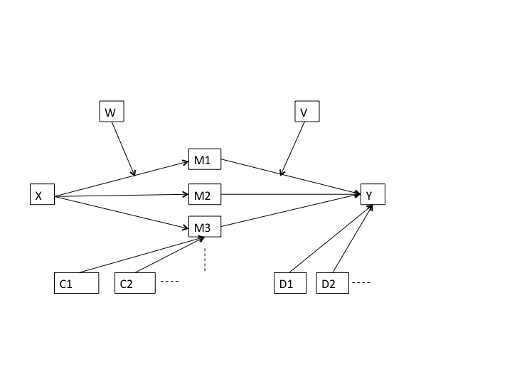

```{r setup, include=FALSE}
knitr::opts_chunk$set(echo = TRUE)
```

### ---------------------------------------------------------------------------

### Introduction

In this tutorial the function  ` moderatedMediationSem() ` is described for the analysis of moderated mediation models. The function is an alternative for the (SPSS or SAS) PROCESS macro developped by Hayes (2018). The ` moderatedMediationSem ` is in the R package ` gemm `. This package can be installed from Github and then loaded using the `library()` function: 

` devtools::install_github("PeterVerboon/gemm") ` 
` library(gemm) `. 


```{r chunk1, eval=TRUE, echo = FALSE, include = FALSE, warning = FALSE}

library(gemm)

```

&nbsp;

An illustration of the moderated mediation model, for which the function can be applied, is shown in Figure 1. The figure represents a structural model, linking the observed variables to each other. We are therefore using the SEM software to fit the moderated mediation model. To this end we use the lavaan package (Rosseel, 2012). Figure 1 shows the most general situation, with several mediators, several covariates for the mediators and several covariates for the dependent variable. There are also two moderators in this model, one for the paths from the predictor to the mediators and one for the paths from the mediators to the dependent variabele.



The function ` moderatedMediationSem() ` calls the functions `buildModMedSemModel()`, which is also in the gemm package and which builds the requested SEM model. After running the function ` moderatedMediationSem() ` there are two methods available that are designed to handle the results: `plot()` and `print()`. These functions will be illustrated in this tutorial.
 

### Examples
The required parameters of the function ` moderatedMediationSem() ` can be found by typing `?moderatedMediationSem`.
This gives the help page of the function. The data that will be used to illustrate the model are included in the package and are in the R object `gemmDat`, which can be loaded by `data("gemmDat")`. After loading the data, you can also learn more about the data by using the question mark.

```{r chunk2, eval=TRUE, echo = TRUE, include = TRUE, warning = FALSE}

?moderatedMediationSem   # shows the help page of the function
data("gemmDat")          # loads the data
?gemmDat                 # shows the desciption page of the data

```
The data have simple and obvious variable names: x and y for the predictor and dependent variable, respectively. The "m" with a number represents mediators and the "c" covariates, numerical moderators start with  "mod" , dichotomous moderators with "bi".

#### The mediation model

The first model that will be illustrated is a straightforward mediation model with three mediators, without moderators and without covariates. The number of bootstrap samples is set to 100, a very small number for bootstraps, but here only used for illustration. 

```{r model1, eval=TRUE, echo = TRUE, include = TRUE, warning = FALSE}

result <- moderatedMediationSem(dat = gemmDat, 
                                xvar ="x1", 
                                mvars = c("m1","m2","m3"),
                                yvar = "y1",
                                nboot = 100)
```

The parameter "xvar" represents the predictor, "yvar" the dependent variable and "mvars" a vector of mediators. The results of the analysis is put the object "result". Except for nboot, these parameters are all obligatory to specify. This implies that you cannot run a simple regression model with this function.
The results can be viewed by typing: ` print(result)`.

```{r model1R, eval=TRUE, echo = TRUE, include = TRUE, warning = FALSE}

print(result)

```

The printed output consists of four parts. First, the function input is shown. Here you can check whether you have specified the model that you intended to run. Second, the explained variance is shown for the dependent variable and the mediators. For the dependent variable the variance is explained by the predictor, the mediator(s), and optionaly also by the covariate(s).For the mediators the variance is explained by the predictor, and optionaly also by the covariate(s). 
The third part shows the direct effect of the predictor on the dependent variable. The confidence interval around this estimate has been obtaind by using the bootstrap samples.
The fourth part shows the indirect effects. eachh row represent an indirect effect through a partical mediator. The last row is the total of all indirect effects. Again boostrap samples are used to obtain the estimates.
Finally, the standardized indirect effects are given, one for each mediator. They represent the completely standardized effect size of the indirect effect.
  
  
  
  

#### The moderated mediation model

In the next example a moderated mediation model is shown.

```{r model2, eval=TRUE, echo = TRUE, include = TRUE, warning = FALSE}

result <- moderatedMediationSem(dat = gemmDat, 
                             xvar  = "x1", 
                             mvars = c("m1","m2"), 
                             yvar  = "y1",
                             mymod = "bimod2", 
                             cmvars = c("c1","c2"), 
                             cyvars = c("c1","c2"),
                             nboot = 100)

print(result)
```


