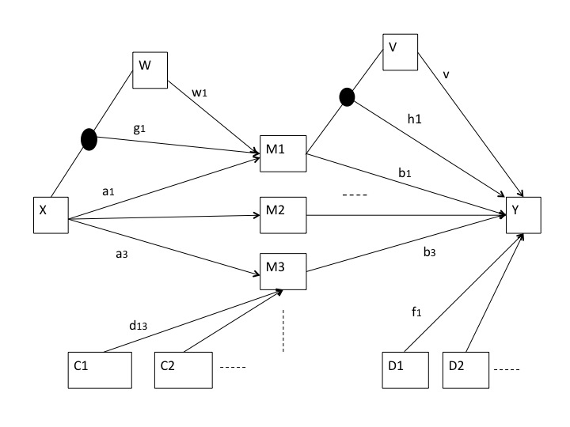

```{r setup, include = FALSE}
library("papaja")
```

```{r analysis-preferences}
# Seed for random number generation
set.seed(42)
knitr::opts_chunk$set(cache.extra = knitr::rand_seed)
```


## Introduction
In modeling the relation between a predictor and a dependent variable there are basically three modeling situations to consider. First, there are other variables that are correlated with the dependent variable, and possibly also with the predictor. Adding such variables, which are usually called covariates, to the regression model may change the regression coefficient of the predictor, and the standard error for this estimate. This is discussed in many textbooks about multivariate and regression analysis. Second, the mechanism explaining the effect between predictor and dependent can be examined by a mediation analysis. The mediator is a variable that partly "explains" the assumed causal process, which links the predictor to the dependent variable. Third, the effect of interest depends on another variable, which is called the moderator. A moderator influences the effect of the predictor on the dependent, implying that the effect is conditional on the value of the moderator.
When the three modeling situations are combined we obtain a general model, which is useful in many applied research. This general model is called the moderated mediation model and is earlier described in the methodological literature (e.g. @Edwards2007; @Hayes2015; @Preacher2007).
In this paper a short description of the moderated mediation model is given. Next the R package “gemm” is discussed, which is developed to analyze this model in an easy and straightforward way.
A moderated mediation model assumes that the effect of a predictor on a dependent variable is mediated by one or more mediators and that the indirect paths in this mediation are moderated. Moderation can take place on the effect of the predictor on the mediators, or on the effect of the mediators on the dependent variable. In this tutorial the function  ` gemm() ` is described for the analysis of moderated mediation models. The function is an alternative for the (SPSS or SAS) PROCESS macro developped by Hayes [@Hayes2018]. The ` gemm ` is in the R package ` gemm `. This package can be installed from Github and then loaded using the `library()` function: 

` devtools::install_github("PeterVerboon/gemm") `


```{r chunk1, eval = TRUE, echo = TRUE, include = TRUE, warning = FALSE}
library(gemm)
```
An illustration of the moderated mediation model, for which the function can be applied, is shown in Figure 1. The figure represents a structural model, linking the observed variables to each other. We are therefore using the SEM software to fit the moderated mediation model. To this end we use the lavaan package [@Rosseel2012]. Figure 1 shows the most general situation, with several mediators, several covariates for the mediators and several covariates for the dependent variable. There are also two moderators in this model, one for the paths from the predictor to the mediators and one for the paths from the mediators to the dependent variabele.




The model is limited in the sense that only one predictor, one dependent variable, and for each path one moderator are defined. Furthermore, serial mediation is not included in this model. The number of mediators and covariates is not limited.

The function ` gemm() ` calls the functions `buildModMedSemModel()`, which builds the requested SEM model. In this model we assume that the covariates for the mediators (C) are correlated with each other, and furthermore that the covariates fir the dependent variable (D) correlate with each other and also with the mediators. If covariates (C) are included in the model, paths are assumed to exist from the covariates (C) to all mediators. For the function to run the model needs to have a predictor, a dependent variable and at least one mediator. All other variables are optional.
This most basic model (predictor --> mediator --> dependent) is just identified: three regression coefficients are estimated from the covariance matrix, containing three correlations. With two mediators there are six datapoints, and als six parameters to estimate (5 regression paths and one covariance between the mediators). With three mediators there are ten datapoints, and also ten parameters to estimate (three regression paths and the three covariances between the mediators). It is easy to see that models with only mediators, a predictor and a dependent variable, are always just identified. The fit values for these model s will therefore show perfect fit. Adding covariates or moderators will result in models in which the parameters have to be estimated iteratively, yielding model fit values that indicate how well the model fits the data.
After running the function ` gemm() ` there are several functions available that are designed to handle the results: `plotSS()`, `plotIMM()`, `plotIMM3d()` and `print()`. These functions will be illustrated in this tutorial.

## Index of moderated mediation
A primary statistic of interest in moderated mediation models is the index moderated mediation (Hays, 2015), which can be plotted by `gemm`. For a good understanding of this index, we will first present its algebraic derivation. 
When there are no moderators or when moderators take the value zero, the indirect (unmoderated) effect is defined as: $a_j b_j$. The indirect moderated effect with the X – M path moderated by W (assuming there is no moderation through V or when V = 0) is derived as follows:
\begin{equation}
 \begin{split}
 M_j = a_j X + w_j W + g_j WX\\
 Y = b_j M_j.
 \end{split}
\end{equation}

  Substitute $M_j$:
  
  \begin{equation}
   \begin{split}
   Y = b_j(a_j X + w_j W + g_j WX)\\
   Y = b_j w_j W + (a_j b_j + b_j g_j W)X.
   \end{split}
  \end{equation}
  A quantification the effect of X on Y as a function of the moderator has been described by Hayes (2015, 2018), who coined the term “index of moderated mediation”. The index of moderated mediation (IMM) is defined here as: 
  \begin{equation}
  IMM_a = a_j b_j + b_j g_j W.
  \end{equation}
  This definition is slightly different from that given by Hayes (2105), since contrary to Hayes(2015), here it also contains the term constant term $a_j b_j$. The IMM for a single path represents the slope (and intercept) of the line that relates the predictor with the dependent variable, as a function of the moderator. The index consists of a fixed part (the indirect effect) and a part that varies with the moderator. The plot of the IMM versus the moderator can be constructed using formula (2), which gives a straight line. This plot shows how the relation between predictor and dependent variable changes when the moderator changes. A flat horizontal line in this plot indicates that there is no moderation. A steep line om the other hand indicates a moderation effect. When W = 0 the IMM represents the indirect (unmoderated) effect.
The single-path IMM is defined for each mediator separately. Likewise, the IMM is defined for each path separately, thus for the path from predictor to mediator (a-path) and also for mediator to the dependent variable (b-path). Foth this reason we refer to it as a single-path IMM. So, for three mediators and two moderators (one for each path), six single-path IMMs can be computed.
Combining both moderators to obtain a double-path IMM would give a two-dimensional plane in a three-dimensional space (instead of a line), defined by the two moderators and the IMM. The index is derived as follows.
\begin{equation}
 \begin{split}
M_j = a_j X + w_j W + g_j WX\\ 
Y = b_j M_j + vV + h_j M_j V. 
 \end{split}
\end{equation}

Substitute M_j:
\begin{equation}
 \begin{split}
Y = b_j(a_j X + w_j W + g_j WX) + vV + h_j (a_j X + w_j W + g_j WX)V\\ 
Y = b_j w_j W + (a_j b_j + b_j g_j W)X + vV + h_j w_j WV + (h_j a_j V + h_j g_j WV)X\\ 
Y = b_j w_j W + vV + g_j w_j WV + (a_j b_j + b_j g_j W + h_j a_j V + h_j g_j WV)X. 
 \end{split}
\end{equation}

The two-dimensional IMM, incorporating both moderators is:
\begin{equation}
IMM = a_j b_j + b_j g_j W + h_j a_j V + h_j g_j WV.
\end{equation}

When one of the moderators is dichotomous, it is more convenient to plot the double-path IMM in a two dimensional space with two lines, one for each category of the moderator.
It is easy to see that formula (6) is a generalization of formula (3), when V = 0 (or absent), and when W = 0 (or absent), the index of moderated mediation (IMM) of the b-path is defined as: 
\begin{equation}
IMM_b = a_j b_j + h_j a_j V.
\end{equation}

Like before, this index indicates how the slope of the effect of X on Y changes as a function of the moderator, here the moderator of the b-path (V) 

## Examples
The required parameters of the function ` gemm() ` can be found by typing `?gemm`.
This gives the help page of the function. The fictious data that will be used to illustrate the model are included in the package and are in the R object `gemmDat`, which can be loaded by `data("gemmDat")`. After loading the data, you can also learn more about the data by using the question mark.

```{r chunk2, eval=TRUE, echo = TRUE, include = TRUE, warning = FALSE}

data("gemmDat")          # loads the data
```
The data have simple and commonly used variable names: x and y for the predictor and dependent variable, respectively. The "m" with a number represents mediators and the "c" covariates, numerical moderators start with "mod", and dichotomous moderators with "bi".

## The mediation model

The first model that will be illustrated is a straightforward mediation model with three mediators, without moderators and without covariates. The number of bootstrap samples is set to 100, a very small number for bootstraps, but here only used for illustration. For a real analysis you might use 5,000 boostraps; the default for nboot is 1,000. 

```{r model1, eval=TRUE, echo = TRUE, include = TRUE, warning = FALSE}

result <- gemm(dat = gemmDat, 
               xvar ="x1", 
               mvars = c("m1","m2","m3"),
               yvar = "y1",
               nboot = 50)
```
The parameter "xvar" represents the predictor, "yvar" the dependent variable and "mvars" a vector of mediators. The result of the analysis is put in the object "result". Except for nboot, these parameters are all obligatory to specify. This implies that neither a simple regression model, nor a moderation model, can be analyzed with this function.
After running the analysis, the results can be viewed by typing: 

```{r model1R, eval=TRUE, echo = TRUE, include = TRUE, warning = FALSE}

print(result)
```
The printed output consists of five parts. First, the function input is shown. Here you can check whether you have specified the model that you intended to run. Second, the explained variance is shown for the dependent variable and the mediators. For the dependent variable the variance is explained by the predictor, the mediator(s), and optionaly also by the covariate(s).For the mediators the variance is explained by the predictor, and optionaly also by the covariate(s). 
The third part shows the direct effect of the predictor on the dependent variable. The confidence interval around this estimate has been obtaind by using the bootstrap samples.
The fourth part shows the indirect effects. Each row represents an indirect effect through a particular mediator. The last row is the total of all indirect effects. Again boostrap samples are used to obtain the estimates.
Finally, in part five the standardized indirect effects are given, one for each mediator. They represent the completely standardized effect size of the indirect effect. This is the effect size, obtained after all variables have been standardized. 
  


## The moderated mediation model

In the next example a moderated mediation model is shown.

```{r model2, eval=TRUE, echo = TRUE, include = TRUE, warning = FALSE}

result <- gemm(dat = gemmDat, 
               xvar  = "x1", 
               mvars = c("m1","m2"), 
               yvar  = "y1",
               mymod = "bimod2", 
               cmvars = c("c1","c2"), 
               cyvars = c("c1","c2"),
               nboot = 50)

print(result)
```
Here we have moderator ("bimod2") added to the model. This variable is assumed to moderate the two effects of the two mediators on the dependent variable. This moderator is a dichotomous moderator, in `R` terminology a factor with two levels (e.g. male and female). The variables c1 and c2 are used as covariates. They are used two times, first as covariates of the mediators (cmvars) and also as covariates of the dependent variabele (cyvars).
The structure of the printed output is similar to the previous analyses. However, we can ask for plots now, because the model contains a moderator. There actually are three plot types. The first type is the single-path index of moderated mediation (Hayes, 2018, p.425), plotted against the moderator. As explained before, the index of moderated mediation (IMM) is the slope of the line representing the effect of the mediator (c.q. predictor) on the dependent variable (c.q. mediator) that changes when the moderator changes. When there are two mediators in the model there are also two IMMs. A flat horizonal line indicates that the slope does not change as a function of the supposed moderator, in that case there is no moderation. The steeper the line the stronger the moderated mediation effect. For a dichotomous moderator only two points are shown (per mediator) with their 95% confidence interval. The command to obtain the single-path IMM is `plotIMM(result)`. 

```{r model2RIMM, eval=TRUE, echo = TRUE, include = TRUE, warning = FALSE}
plotIMM(result)
```
The IMM for the first mediator (m1) is somewhat larger than for the second (m2). However, for both mediators the IMM hardly changes between the two categories of the moderator.  

The second plot type is the mediated simple slopes plot. A simple slope plot shows the indirect effect of the predictor on the dependent variable through a mediator for usually two characteristic values of the moderator. Each value of the moderator is represented by a separate line. Parallel lines indicate absence of moderation and crossing lines the presence of moderation. The 95% CI interval around each line is indicated by a shaded area. For each mediator a separate subplot is given. 
  
```{r model2RSS, eval=TRUE, echo = TRUE, include = TRUE, warning = FALSE}
plotSS(result)
```
These plots show the effect of the predictor on the dependent variable through the mediators m1 and m2, respectively. Because the moderator is a dichotomous variable each plot contains two lines, one for each category of the moderator.

As a final example we illustrate the use of two numerical moderators.

```{r model3, eval=TRUE, echo = TRUE, include = TRUE, warning = FALSE}

result <- gemm(dat = gemmDat, 
               xvar  = "x1", 
               mvars = c("m1","m2"), 
               yvar  = "y1",
               xmmod = "mod1", 
               mymod = "mod2",
               nboot = 50)

plotIMM(result)
```
The first plot command provides two plots, for each moderator a separate plot of the single-path IMM, with in each plot a separate line for each mediator. In the first plot (for mod1) we see that for the second mediator the IMM becomes more negative as the value of the moderator increases. So, the effect of x1 on y1 is more negative for larger values of mod1. 

The second plot command provides a simple slopes plots, one for each moderator, where each plot is split into subplots for each mediator. The lines represent the effect evaluated at the 16th and 84th percentile of the moderator, as recommended by Hayes(2018). Only for mod1 and mediator m2 there seems moderation, because we can see crossing lines. In the other three cases the lines run parallel to each other, indicating no relevant moderation effects. 

```{r model3SS, eval=TRUE, echo = TRUE, include = TRUE, warning = FALSE}
plotSS(result)
```

The `plotIMM3d(result)` command provides 3d-plots showing the double-path IMM for both moderators. Separate plots are given for each mediator. The message is the same as in the previous plots: only the following moderated mediation effect appears to be present: the indirect effect of x1 on y through the second mediator is moderated by mod1. 

```{r model3IMM3d, eval=TRUE, echo = TRUE, include = TRUE, warning = FALSE}
plotIMM3d(result)
```


##  Additional output
The `result` object is a list of three elements, which are named input, intermediate, and results, respectively. Input contains the original data and all variable names used in the analysis. Intermediate contains results that have been computed in the functions. For instance the object `result$intermediate$model ` contains the model specification that was used by lavaan, the object `result$intermediate$result ` contains the output of lavaan. You can inspect this output by loading the package lavaan and then using `summary(result$intermediate$result)`. All other lavaan extract functions can be used on this object. The object `result$intermediate$parameterEstimates` contains all estimated parameters from lavaan. 
For example, when you want to see some important fit measures obtained in lavaan, you may type:
```{r lavaan_ex, eval=TRUE, echo = TRUE, include = TRUE, warning = FALSE}
lavaan::fitmeasures(result$intermediate$result)[c("cfi","tli","rmsea","chisq", "df")]
```
In this way you are able to inspect all other lavaan results.

## Note
We used `r cite_r("Refs_gemm.bib")` for all our analyses.

\newpage

# References
```{r create_references}
r_refs(file = "Refs_gemm.bib")
```

\begingroup
\setlength{\parindent}{-0.5in}
\setlength{\leftskip}{0.5in}

<div id = "refs"></div>
\endgroup
